# VBA_personal_budget_app
## Project Description:
The project is designed to manage your personal budget. 
Using this application you can:
  - Add expenses/income by category
  - See statistics :
      - average monthly expenses/income by category in the selected year (also on the chart)
      - the percentage change in expenses in the selected year by category and month
      - the percentage change in expenses by category and year (also on the chart)
      - compare the amount of expenses and income by month (also on the chart)
  - Calculate the future value of the investment
  - Calculate loan repayments
  - Make a report of the entire expense history (in PDF form) or a report of expenses in a selected month in a specific year (in Word form)
## What I learned 
In the process of creating this project, I learned :
- the basics of coding in VBA
- importing data from Excel into files of other types using VBA
- handling graphs using VBA.
## Screenshots
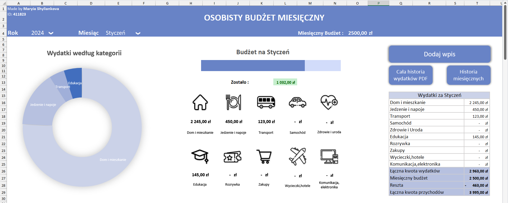
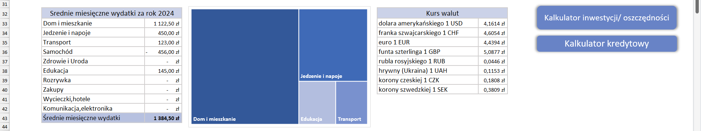
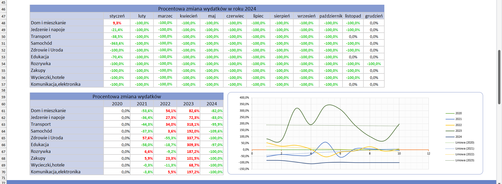
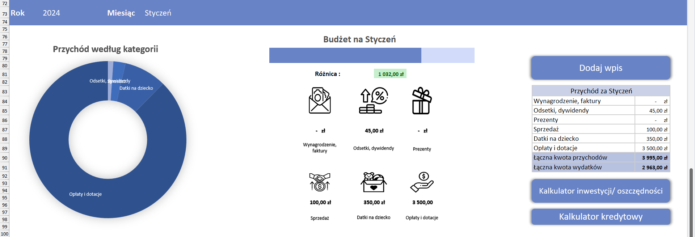
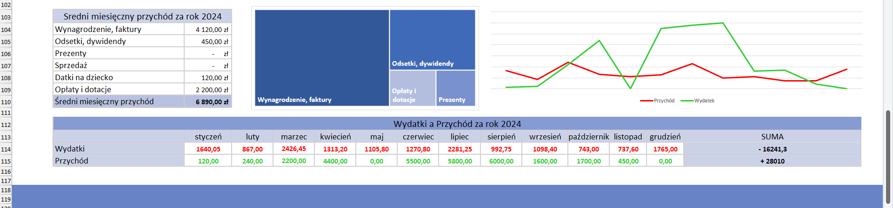
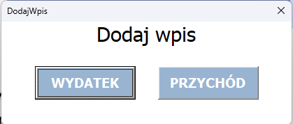
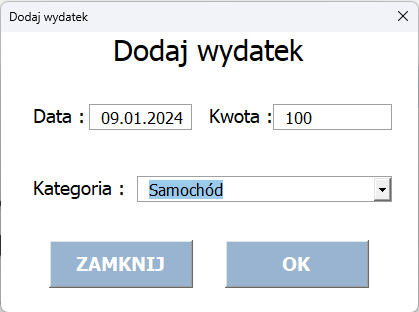
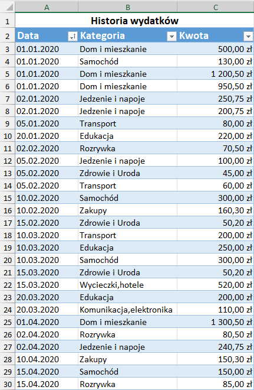
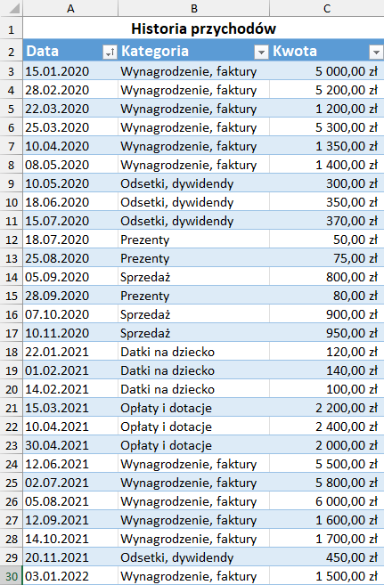
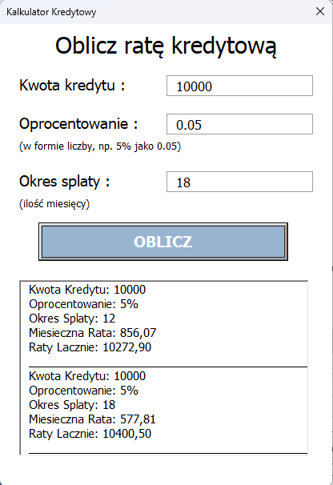
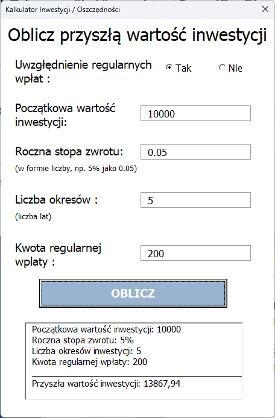
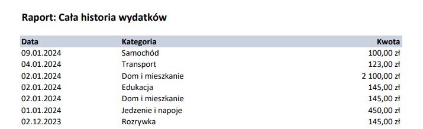
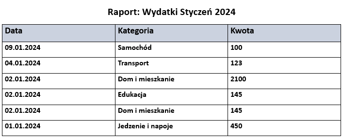
